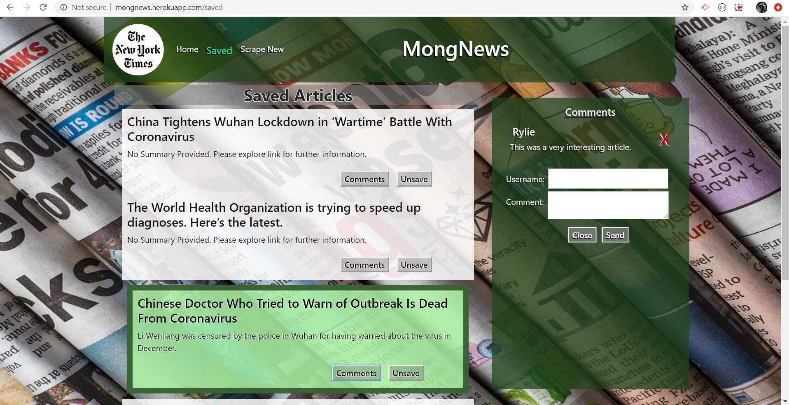

# [MongNews](https://mongnews.herokuapp.com/)
### By: [Dana Cronin](decronin.github.io)

### [Concept/Requirements](https://github.com/UCF-Coding-Boot-Camp/UCF-LKM-FSF-PT-08-2019-U-C/blob/master/old_curriculum/18-mongo-mongoose/02-Homework/Instructions/homework_instructions.md)

### How To Use:
- The Home Page of the website/app displays all of the database's "Unsaved" and previously Scraped Articles from the home-pages of the [New York Times](https://www.nytimes.com/) whereas the Saved Page displayes all of the database's articles marked "Saved".
    - These Articles' Display-Blocks are a link and include:
        - _Opening Full NYT-Article in New Tab (May Ask User to Login to View)_
        - Headline
        - Summary
        - Comments Button _(Clisk to Display:)_
            - Active-Article Stands Out
            - All of this Atricle's Available Comments'
                - User
                - Comment
                - "X" Button to Delete Associated Comment
            - New Comment Form
                - User Input
                - Comment Input
                - "Send" Comment Button
            - "Close" Comment View Button _(Makes Comments Box Invisible Again)_
        - Save or Unsave Button _(Updates Status in Database)_
- The NYT-Logo in the top-left will open the offifial NYT Website
- Navigate between Saved and Unsaved(Home) with links at top of page
- _Click_ "Scrape New" to pull New Article's and their information from today's NYT Front-Page and send them to the Database if they Do Not already exist

#### Demonstration(s):

### Resources:
- [Node.js](https://nodejs.org/en/)
- [Express](https://www.npmjs.com/package/express)
- [Express-Handlebars](https://www.npmjs.com/package/express-handlebars)
- [MongoDB](https://www.mongodb.com/)
- [Mongoose](https://mongoosejs.com/)
- [Heroku](https://www.heroku.com/home)
- [Cheerio](https://cheerio.js.org/)
- [Axios](https://www.npmjs.com/package/axios)
- [Visual Studio Code](https://code.visualstudio.com/)
- [New York Times Website](https://www.nytimes.com/)